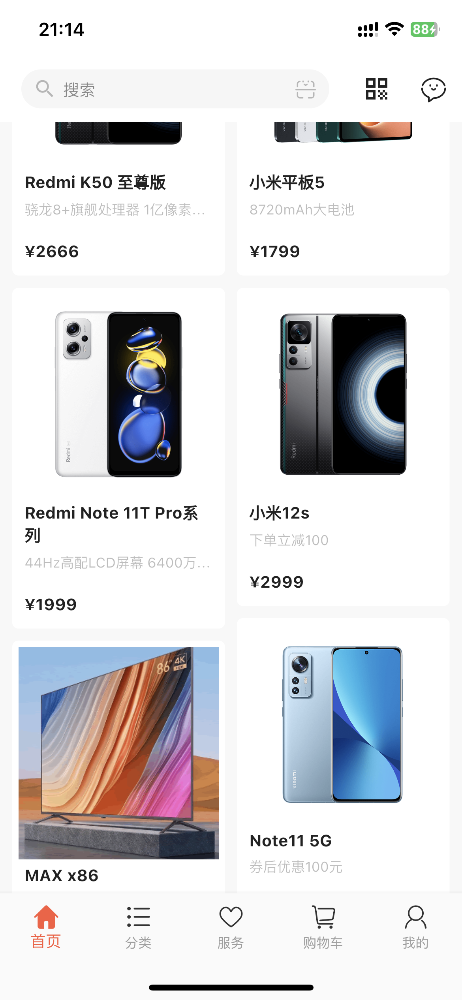
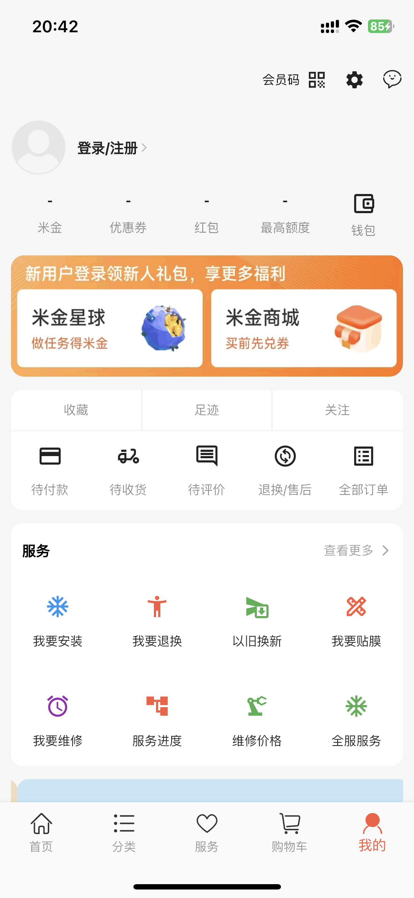
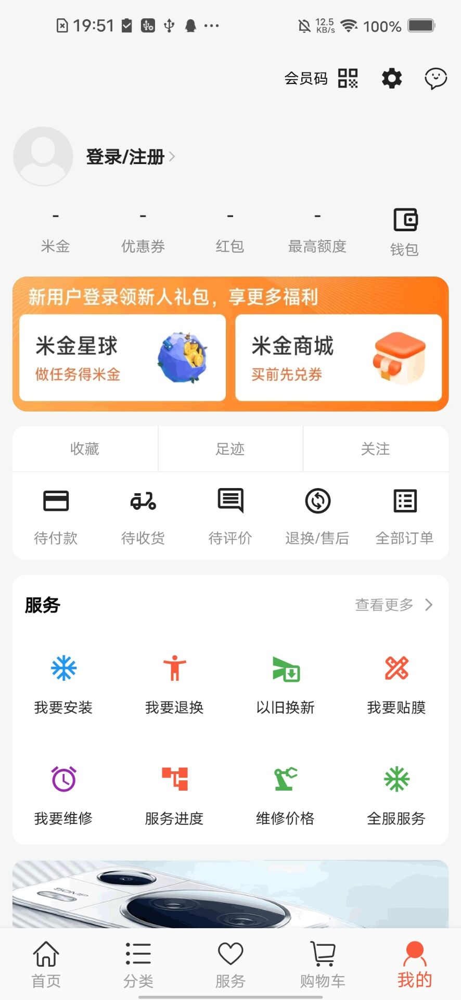
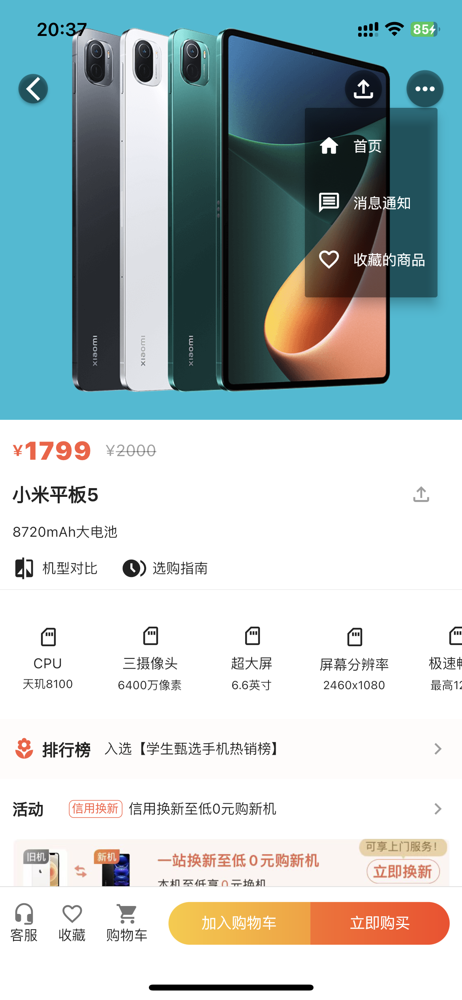

# 小米商城app

<div align=center>

</div>


一款用Flutter编写的小米商城app

> 项目目前已经完成从: 商品列表->商品详情->购物车->结算->支付->生成订单,这条主线功能以及有关联的附属功能;
>
> 目前还在不断更新迭代中，部分功能使用的在线接口api，部分使用的本地存储, 后续有意自己用Python实现后台替换成自己的api;
>
> 功能的实现努力做到更好，但仍然有许多有待完善的地方，希望可以分享交流指正，查漏补缺。

## Show

> 主页面展示分别为iOS与Android双端，其他功能页面展示仅以iOS手机截图为例

### iOS

<div align=center>







</div>

### Android

<div align=center>





</div>

### 各子页面(iOS为例)

<div align=center>





</div>

## Done

#### v1.0.1：2023-04-03更新
- [x] 首页
- [x] 分类
- [x] 服务
- [x] 购物车
- [x] 我的
- [x] 商品列表页
- [x] 搜索
- [x] 商品详情页
- [x] 手机验证码登录
- [x] 账号密码登录
- [x] 注册
- [x] 设置
- [x] 地址管理
- [x] 结算
- [x] 支付
- [x] 订单列表
- [x] 订单详情
- [x] Salt接口签名较验
- [x] 在线网页加载插件
- [x] 更换图标
- [x] 扫码功能
- [x] 拍照及相册选择功能
- [x] 多语言国际化与本地化功能：只配置了部分界面的多语言为例
- [x] 暗黑模式功能：需要每个页面对背景色加以配置
- [x] 更换主题颜色功能：需要对themeData完整配置
- [x] app启动页
- [x] app引导页
- [x] 闪屏活动页功能(可配置)
- [x] 版本信息获取与展示
- [x] Badge
- [x] 过滤筛选向下弹框

### 目录结构

>项目基于`Get-Cli`脚手架搭建，Get是整个项目的核心插件，涉及项目搭建，路由，状态管理，组件使用等功能

|  一级目录  |  二级目录   |   文件名  |   描述    |
---|:--:|:--:|:---:|
| assets|        |    | 素材目录| 
| assets| images |    | 图片素材库 | 
|      | fonts     |  | 字体库(包含阿里巴巴图标字体素材)| 
| app  |           |  | app目录 | 
|      | components|  | 抽取全局通用组件目录 | 
|      | models    |  | 模型类目录 | 
|      | modules   |  | 页面组件目录 | 
|      |           |   tabs               | tabs管理页 | 
|      |           |   auth               | 登录及注册相关 | 
|      |           |   home               | 首页 | 
|      |           |   category           |  分类| 
|      |           |   service            | 服务 | 
|      |           |   cart               | 购物车 | 
|      |           |   me                 | 我的 | 
|      |           |   goodsList          | 商品列表 | 
|      |           |   goodsContent       | 商品详情 | 
|      |           |   search             | 搜索 | 
|      |           |   checkout           | 确认订单-结算 | 
|      |           |   payment            | 支付 | 
|      |           |   orderList          | 商城订单列表 | 
|      |           |   orderContent       | 订单详情 | 
|      |           |   setting            | 设置| 
|      |           |   address            | 地址管理、新建地址、修改地址 | 
|      |           |   profile            | 个人资料 | 
|      |           |   personalHomepage   | 个人主页 | 
|      |           |   customerService    | 客服 | 
|      |           |   officialService    | 官方服务 | 
|      |           |   vipCode            | 我的会员码 | 
|      |           |   vipMedal           | 小米会员勋章 | 
|      |           |   messageNotification| 消息通知 | 
|      |           |   message            | 消息 | 
|      |           |   afterSale          | 售后服务 | 
|      | routes    |                       |  路由配置目录   | 
|      | services  |                       | 服务及工具类目录 | 
|      |    |  app_cartService.dart        | 购物车功能服务类，基于app_sharedPreferences.dart的封装 | 
|      |    |  app_colors .dart            | 项目常用颜色管理类 | 
|      |    |  app_fontIcons.dart          | 基于阿里巴巴图标字体素材功能类 | 
|      |    |  app_keepAliveWrapper.dart   | 页面保活类 | 
|      |    |  app_network.dart            | 网络类，基于dio的封装 | 
|      |    |  app_screenAdapter.dart      | 项目适配类，基于flutter_screenutil的封装 | 
|      |    |  app_searchService.dart      | 搜索功能服务类，基于app_sharedPreferences.dart的封装 | 
|      |    |  app_sharedPreferences.dart  | 基于shared_preferences的封装 | 
|      |    |  app_signService.dart        | 签名生成获取类 | 
|      |    |  app_userService.dart        | 登录后获取的用户信息类 | 
| main.dart |   |   |  项目入口文件 | 


### 使用插件

> 后续功能会增加插件的使用

```
  flutter_localizations
  cupertino_icons: ^1.0.2
  dio: ^5.0.2
  get: ^4.6.5
  flutter_screenutil: ^5.7.0
  shared_preferences: ^2.0.18
  flutter_swiper_view: ^1.1.8
  flutter_staggered_grid_view: ^0.6.2
  flutter_html: ^3.0.0-alpha.5
  flutter_spinkit: ^5.1.0
  flutter_easyloading: ^3.0.3
  pull_to_refresh: ^2.0.0
  pin_code_fields: ^7.4.0
  roundcheckbox: ^2.0.5
  city_pickers: ^1.2.1
  crypto: ^3.0.2
  flutter_swipe_action_cell: ^3.1.0
  webview_flutter: ^4.0.5
  flutter_native_splash: ^2.2.19
  image_picker: ^0.8.6+4
  barcode_scan2: ^4.2.3
  badges: ^3.0.3
```

## ToDo

### Improve
- [x] 商品详情页：详情及推荐头部切换(包含点击与滑动)时，二级头部(商品介绍与规格参数)展示有细微误差,其中包含了二级头部内容长度不同时的问题待修正;
- [x] 商品详情页中点击购物车，在购物车推荐列表再点击商品进入购物车，如此循环嵌套，其中涉及的商品详情页及购物车整体结构还需要完善;

### Features
- [x] 集成地图定位
- [x] 视频录制及播放功能
- [x] 集成埋点统计
- [x] 集成推送通知
- [x] 集成运营商一键登录
- [x] 集成第三方登录
- [x] 集成第三方分享
- [x] 集成微信及支付宝支付
- [x] wifi通讯功能
- [x] 蓝牙通讯功能


